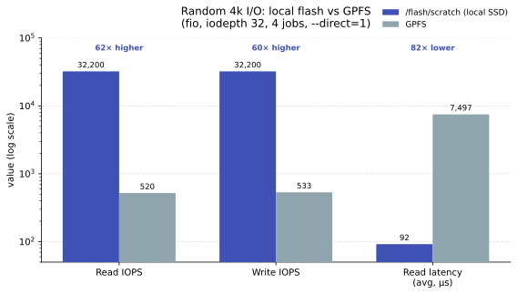

# GPU Nodes Fast local scratch (`/flash`)

A number of GPU nodes have fast local NVMe drives for jobs that require a lot of I/O.
Unlike the shared GPFS/Lustre filesystem ( filesystem we use to host home, `/well/`)  which is optimised for large, sequential,
parallel throughput, this local storage lives *inside the compute node* and
excels at **random, small-block, high-IOPS access**: many small files, frequent
seeks, index/database access, and metadata-heavy workloads.

!!! circle-info "Where it lives"
    Local scratch is available at:

    - `/flash/scratch` — shared scratch, open to all jobs
    - project-specific folders under `/flash` on the node
    
    It is **node-local and ephemeral**: data written here is only visible on the
    node that wrote it, and is **not** available from the login nodes, other
    compute nodes, or after the job ends. Treat it as working space for a single
    job, and stage important results back to GPFS before the job finishes.

## Requesting a node with local scratch

Add the `--constraint "flash"` feature to your Slurm request. For a batch job:

<div class="nord" markdown="1">
```py
sbatch --account gpu_<X>.prj -p gpu_p100_16gb --gres gpu:1 --constraint "flash" <JOBSCRIPT>
```

For an interactive session:

```py
srun --account --gres gpu:1 --partition gpu_interactive --constraint "flash" --pty bash
```

You can confirm the node actually has the feature with:

```py
scontrol show node "$(hostname)" | grep -i ActiveFeatures
```


## Creating your project folder

It is your responsibility to create a folder for your job. Because
`/flash/scratch` is shared by **all** jobs on the node, protect your data by
placing it in a subfolder with restrictive permissions:

```py
mkdir -p /flash/scratch/$USER
chmod 700 /flash/scratch/$USER    # owner-only: rwx------
```

!!! warning "Directories need the execute bit"
    Use `700`, not `600`. Without the execute (`x`) bit you will not be able to
    `cd` into the directory or open files inside it (`Permission denied`).
    `700` gives you full private access; `750` also lets your group read it.

Always clean up when your job finishes:

```py
rm -rf /flash/scratch/$USER
```

</div>

!!! brush "Automatic cleanup in your job script"

## When should I use it?

Choose your storage based on your **access pattern**, not just file size:

| Use `/flash/scratch` when…                                   | Stay on GPFS when…                         |
| ------------------------------------------------------------ | ------------------------------------------ |
| Many small files (thousands+)                                | A few large files                          |
| Random reads/writes, frequent seeks                          | Long sequential streaming reads/writes     |
| High IOPS / metadata-heavy (index files, small DB, checkpoint shuffling) | Bulk staging of large datasets             |
| You want to take I/O load *off* the shared filesystem        | You need the data visible across nodes     |
| Intermediate scratch for a single job                        | Final results / anything that must persist |

A good pattern is: **stage inputs from GPFS → run with heavy random I/O against
`/flash/scratch` → copy final outputs back to GPFS → clean up.**

## Benchmark: local flash vs GPFS

The difference is workload-dependent, and it matters which workload you measure.

**Large sequential I/O** (`dd`, 4 GiB, 1 MiB blocks) — GPFS is *already excellent*
here, since it stripes across many storage servers. Local flash offers no
advantage for streaming:

|                  | `/flash/scratch`   | GPFS      |
| ---------------- | ------------------ | --------- |
| Sequential write | ~1.2 GB/s          | ~3.9 GB/s |
| Sequential read  | (cache-influenced) | ~3.8 GB/s |

**Random 4k I/O** (`fio`, `iodepth 32`, 4 jobs, `--direct=1`) — this is where
local flash wins decisively:

| Metric           | `/flash/scratch` | GPFS      | Advantage      |
| ---------------- | ---------------- | --------- | -------------- |
| Read IOPS        | 32,200           | 520       | **~62×**       |
| Write IOPS       | 32,200           | 533       | **~60×**       |
| Read bandwidth   | 126 MiB/s        | 2.0 MiB/s | ~62×           |
| Avg read latency | 92 µs            | 7,497 µs  | **~82× lower** |
| p99 read latency | 0.25 ms          | 49 ms     | ~200× lower    |

<br>
<p align="center" style="margin-bottom: -1px;">
    
</p>

The latency tail is the real story: on GPFS every random read pays a network
round-trip to a storage/metadata server, so tail latency runs into tens of
milliseconds. On local flash the read hits NVMe directly and stays in the
microsecond range. If your job does a lot of random reads or touches many small
files, local scratch can turn an I/O-bound job into a compute-bound one.

!!! note-sticky "Benchmark your own workload"
    These numbers are from a single node and depend on the underlying device
    (some nodes use SATA SSDs, others true NVMe). Run a quick `fio` random-I/O
    test on your allocated node if you want to confirm the gain for your
    specific access pattern before committing a large job.