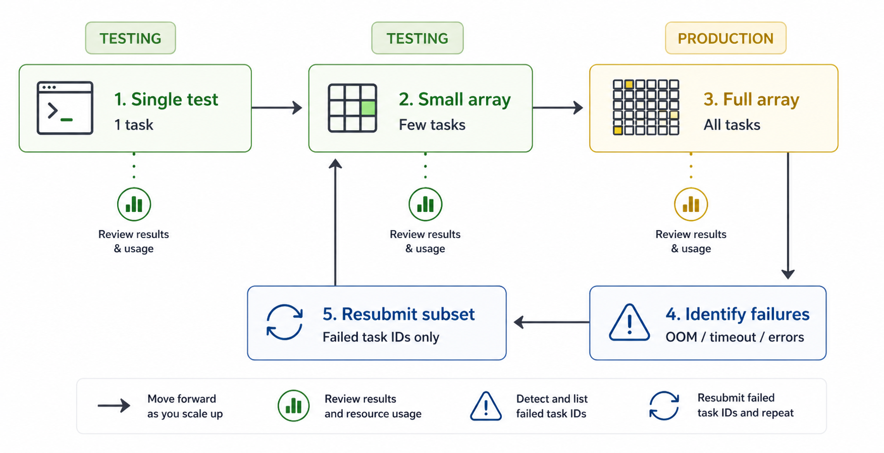
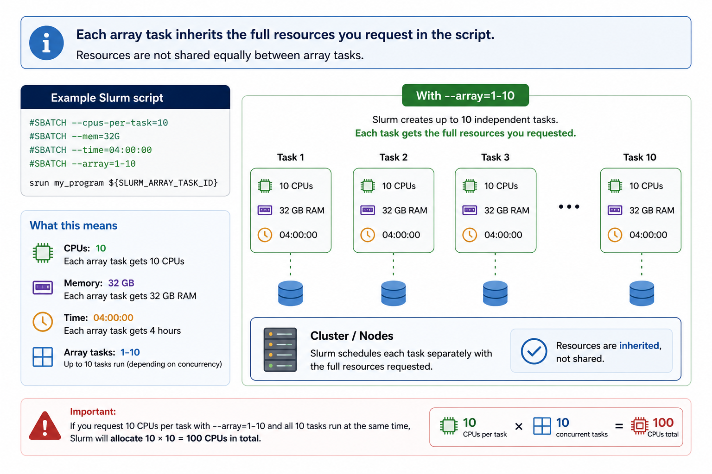

# Slurm job arrays

Job arrays let you submit many similar jobs with a single `sbatch` command. Each task in the array runs the same script but receives a unique index — `SLURM_ARRAY_TASK_ID` — which you use to vary inputs, filenames, parameters, or random seeds.

They're the right tool for **embarrassingly parallel** work: tasks that are fully independent, share no state, and could run in any order. Common examples include parameter sweeps, bootstrap resampling, per-sample processing pipelines, and simulation replicates.

!!! note-sticky "Array size limit"
    The maximum number of tasks in a single array is **60000**. If your workload exceeds this, contact the [KIR Research Computing Team](mailto:kir-rc@kennedy.ox.ac.uk).

<br/>

<p align="center" style="margin-bottom: -1px;">
    
</p>

<center>
<small>Life cycle of a Slurm job array</small>
</center>
---

## Basic syntax

<div class="nord" markdown=1>
```rust
#SBATCH --array 1-10
```

This submits 10 tasks. Each receives a unique value of `SLURM_ARRAY_TASK_ID` from 1 to 10. You can also specify step sizes or throttle the number of concurrently running tasks:

```rust
#SBATCH --array 0-99        # 100 tasks, zero-indexed
#SBATCH --array 1-20:2      # step of 2: indices 1, 3, 5 ... 19
#SBATCH --array 1-100%5     # at most 5 tasks running simultaneously
```

The `%N` throttle is particularly useful when tasks are memory- or I/O-intensive and you want to avoid saturating the filesystem or node.

<br/>

<p align="center" style="margin-bottom: -1px;">
    
</p>

---

## A minimal example

```rust
#!/bin/bash

#SBATCH --job-name    array-demo
#SBATCH --time        00:10:00
#SBATCH --mem         4G
#SBATCH --array       1-5
#SBATCH --output      logs/job_%a.out
#SBATCH --error       logs/job_%a.err

echo "Task ${SLURM_ARRAY_TASK_ID} running on $(hostname)"
```

!!! lightbulb "Tip"
    Inside `#SBATCH` headers, `SLURM_ARRAY_TASK_ID` is not yet available as a shell variable. Use the token `%a` in your `--output` and `--error` paths instead.

---

## Using `SLURM_ARRAY_TASK_ID`

### One file per task

The most common pattern in bioinformatics — one sample, one task:

```py
SAMPLES=(sample_A sample_B sample_C sample_D sample_E)
SAMPLE=${SAMPLES[$SLURM_ARRAY_TASK_ID]}

echo "Processing ${SAMPLE}"
```

Set `--array 0-4` to match bash's zero-based array indices.

If your files follow a naming convention, reference them directly:

```py
INPUT=data/sample_${SLURM_ARRAY_TASK_ID}.fastq.gz
```

Or glob them dynamically:

```py
FILES=(data/*.fastq.gz)
INPUT=${FILES[$SLURM_ARRAY_TASK_ID]}
```

The glob expands in alphabetical order, so the task-to-file mapping is deterministic. Set `--array` to match the number of files.

---

### Passing the index to R or Python

A clean pattern is to pass the task ID as a command-line argument and look up parameters from a config file:

=== "R"

    ```py
    Rscript analysis.R --task ${SLURM_ARRAY_TASK_ID}
    ```

    ```r
    library(optparse)

    option_list <- list(
      make_option("--task", type = "integer")
    )
    args <- parse_args(OptionParser(option_list = option_list))

    params <- read.csv("params.csv")
    row    <- params[args$task, ]

    # use row$alpha, row$beta, etc.
    ```

    Or read the environment variable directly:

    ```r
    task_id <- as.integer(Sys.getenv("SLURM_ARRAY_TASK_ID"))
    params  <- read.csv("params.csv")
    row     <- params[task_id, ]
    ```

=== "Python"

    ```py
    python run_sim.py --task ${SLURM_ARRAY_TASK_ID}
    ```

    ```py
    import argparse
    import pandas as pd

    parser = argparse.ArgumentParser()
    parser.add_argument("--task", type=int)
    args = parser.parse_args()

    params = pd.read_csv("params.csv")
    row    = params.iloc[args.task]

    # use row["alpha"], row["beta"], etc.
    ```

    Or read the environment variable directly:

    ```py
    import os
    task_id = int(os.environ["SLURM_ARRAY_TASK_ID"])
    ```

---

### Setting random seeds for reproducibility

When running stochastic simulations, each task needs a distinct seed. Without one, tasks that start simultaneously may draw from the same pseudo-random sequence.

=== "R"

    ```r
    task_id <- as.integer(Sys.getenv("SLURM_ARRAY_TASK_ID"))
    set.seed(task_id)
    ```

=== "Python"

    ```py
    import os, random
    import numpy as np

    task_id = int(os.environ["SLURM_ARRAY_TASK_ID"])
    random.seed(task_id)
    np.random.seed(task_id)
    ```

---

## Avoiding conflicts between tasks

All tasks in an array can run simultaneously, so any shared resource — a working directory, a fixed output filename, a database connection — is a potential conflict. The fix is always the same: make everything per-task.

**Give each task its own working directory** when a tool writes to fixed paths you can't control:

```py
WORKDIR=tmp/run_${SLURM_ARRAY_TASK_ID}
mkdir -p "$WORKDIR"
cd "$WORKDIR"

bash ../job.sh

mv output.tsv ../../results/output_${SLURM_ARRAY_TASK_ID}.tsv
cd ../..
rm -rf "$WORKDIR"
```

**Use per-task paths directly** when your tool accepts them:

```py
python run.py \
  --input  data/sample_${SLURM_ARRAY_TASK_ID}.csv \
  --output results/sample_${SLURM_ARRAY_TASK_ID}.csv
```

---

## Multidimensional parameter sweeps

To sweep across two independent axes, encode both into a single array index using integer division and modulo:

``` rust
#!/bin/bash

#SBATCH --array 0-11    # 3 models × 4 lambda values

MODELS=("lasso" "ridge" "elastic")
LAMBDAS=(0.01 0.1 1.0 10.0)

N_LAMBDA=${#LAMBDAS[@]}

MODEL=${MODELS[$(( SLURM_ARRAY_TASK_ID / N_LAMBDA ))]}
LAMBDA=${LAMBDAS[$(( SLURM_ARRAY_TASK_ID % N_LAMBDA ))]}

echo "Model: ${MODEL}, Lambda: ${LAMBDA}"
python train.py --model "$MODEL" --lambda "$LAMBDA"
```train.py --model "$MODEL" --lambda "$LAMBDA"
```

This produces all 12 combinations from a single array of 0–11.

---

## Monitoring array jobs

```py
squeue --me                  # all your jobs, including arrays
squeue --me -j <jobid>       # tasks for a specific array job
sacct -j <jobid> --format=JobID,State,Elapsed,MaxRSS
```

Individual tasks appear in the queue as `<jobid>_<taskid>`.

---

## Further reading

- [Slurm job array documentation](https://slurm.schedmd.com/job_array.html)
