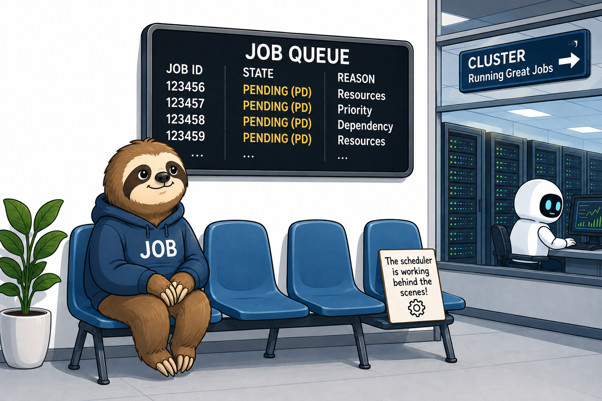

# Why are my jobs waiting?

<p align="center" style="margin-bottom: -1px;">
    
</p>


When you submit a job to the cluster, it does not always start immediately. Slurm places
the job in a **PENDING (PD)** state and records a **REASON** explaining ( abstract )  why it has not yet
started. In the large majority of cases a pending job is entirely normal and requires no
action.i.e. the scheduler is simply waiting for the right conditions to run it.


You can inspect the reason for your own pending jobs with:

<div class="nord" markdown="1">
```py
squeue --me --states=PENDING
```
</div>

The **`NODELIST(REASON)`** column shows the pending reason in parentheses. The sections below
explain the reasons you are most likely to encounter, and which ones &mdash; if any &mdash;
call for action on your part.

!!! tip "Quick guidance"
    Most pending reasons resolve on their own. `Priority` and `Resources` require nothing
    from you. `PartitionConfig` and `ReqNodeNotAvail` (reservations) usually indicate that
    something in your submission needs correcting.

## `Priority`

**Action required: none.**

This is by far the most common reason and does **not** indicate a problem with the cluster.
It simply means that other jobs ahead of yours in the queue have a higher priority, and the
scheduler is working through them first. The cluster is shared, and priority is calculated
from factors such as fair-share usage, how long a job has been waiting, and the resources
requested.

Your job will start once it reaches the front of the queue and the resources it needs become
available. No action is needed &mdash; please allow the scheduler to do its work.

---

## `Resources`

**Action required: none.**

Your job is next in line to run, but the resources it has requested (CPU cores, memory, GPUs,
or a combination) are not currently free. The scheduler is holding a place for your job and
will start it as soon as enough resources are released by jobs that are currently running.

This reason is expected when the cluster is busy. If a job requests an unusually large amount
of a resource, it may wait longer simply because a suitably large free slot takes longer to
appear.

---

## `PartitionConfig`

**Action required: yes &mdash; your job will not start until you correct it.**

Unlike `Priority` and `Resources`, this reason means your job as submitted is incompatible
with the configuration of the partition it was sent to, and it will **never start** in its
current form. The request must be corrected and the job resubmitted.

A frequent cause on our cluster is a **GPU job submitted without the correct GPU account**.
GPU partitions require an appropriate account to be specified, and its absence prevents the
job from ever being scheduled. ( Refer to [the relevant section on GPU support page](./using_gpus.md#gpu-jobs-require-a-separate-slurm-account))

Other causes include requesting more resources (cores, memory, or a walltime) than the
partition permits. Review the partition's limits and adjust your request accordingly, then
resubmit.


## `ReqNodeNotAvail (reservations and maintenance windows)`

**Action required: often yes &mdash; check your requested walltime.**

You may see a reason such as `ReqNodeNotAvail, Reserved for maintenance` (sometimes shown as
`ReqNodeNotAvail, UnavailableNodes:...`). This is common in the period leading up to a
**scheduled maintenance window**, during which we reserve the compute nodes so that no user
jobs are running when maintenance begins.

If a pending job **cannot finish before the reservation starts**, the scheduler will not
start it, and it will remain in this state until after the maintenance window has passed.

The most avoidable cause of this is an **incorrectly requested walltime**. If you do not set
a walltime explicitly, your job is given the partition's **default**, which is often far
longer than the job actually needs. A job that would finish quickly can then be blocked simply
because its default walltime overruns the reservation.

!!! example "Worked example"
    Suppose a maintenance reservation begins in **24 hours** and you submit a set of jobs to
    the `short` partition, each of which will in reality finish within **10 hours**.

    If you do not request a walltime, each job inherits the partition default (for example
    **30 hours** on `short`, or up to **10 days** on `long`). Even though the work would
    comfortably finish before the reservation, Slurm sees a 30-hour job that cannot complete
    within the 24-hour gap, and holds it in the pending state.
    
    Requesting an appropriate walltime resolves this:
    
    <div class="nord" markdown="1">
    ```rust
    #SBATCH --time=10:00:00
    ```
    </div>
    
    With a 10-hour walltime the scheduler can see that the job will finish before the
    reservation begins, and it is free to start.

Always set `--time` to a realistic estimate of your job's runtime. This helps both your own
jobs (avoiding needless blocking before reservations) and overall scheduling on the cluster.

---

## Other pending reasons you may encounter

The four reasons above account for most cases, but you may occasionally see others:

- **Dependency** &mdash; your job is waiting for another job to finish first, because you
  submitted it with a dependency (for example `--dependency=afterok:<jobid>`). It will start
  once the job it depends on has completed as required. No action is needed unless the
  dependency job fails.

- **QOSMaxJobsPerUserLimit** / **AssocMaxJobsLimit** (and similar) &mdash; you have reached a
  limit on the number of jobs or the quantity of resources you may run at once. Queued jobs
  will start as your running jobs complete. No action is needed.

- **AssocGrpCPULimit**, **AssocGrpGRES**, and related **AssocGrp...** reasons &mdash; a group
  or account limit has been reached. Your jobs will start as capacity frees up.

- **launch failed requeued held** &mdash; a job failed to launch and has been held. This one
  does require attention: contact the research computing team so we can investigate.

- **BeginTime** &mdash; you asked the job to start no earlier than a specified time (for
  example with `--begin`). It will start at or after that time.


## When to contact us

Please get in touch with the research computing team if:

- a job shows `PartitionConfig` and you are unsure how to correct your submission;
- a job is held (for example `launch failed requeued held`);
- a job has been pending far longer than the queue length would explain, or the reason is one
  you do not recognise.

For the routine reasons &mdash; `Priority`, `Resources`, `Dependency`, and the various limit
reasons &mdash; no action is required, and your jobs will start automatically once conditions
allow.