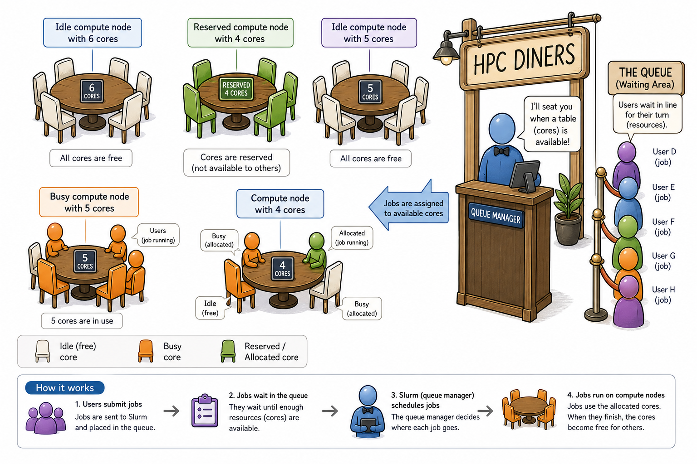
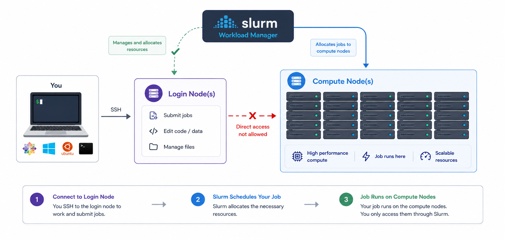
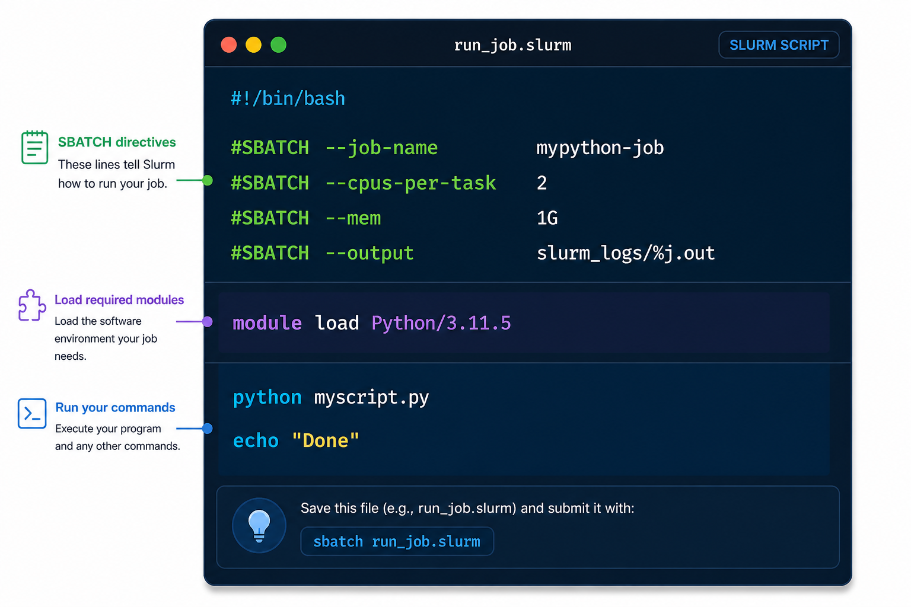
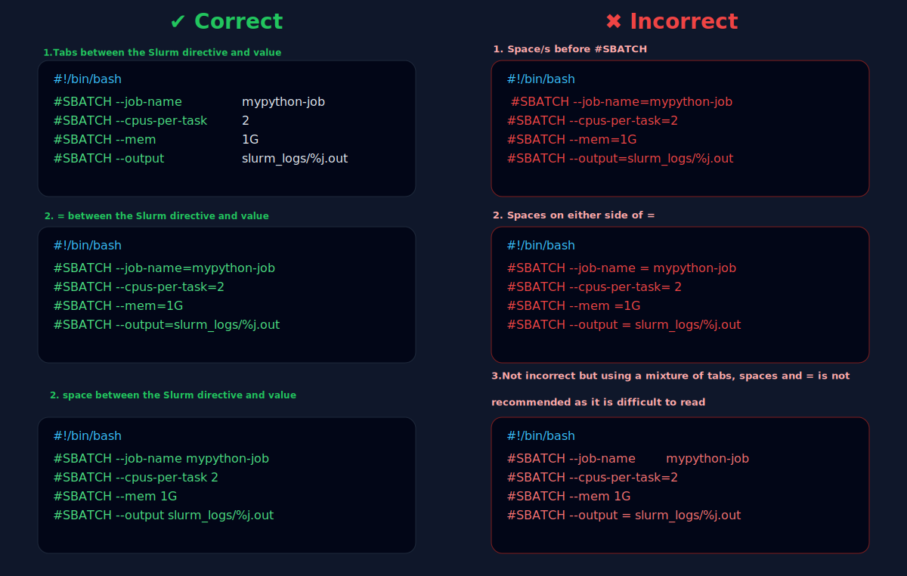
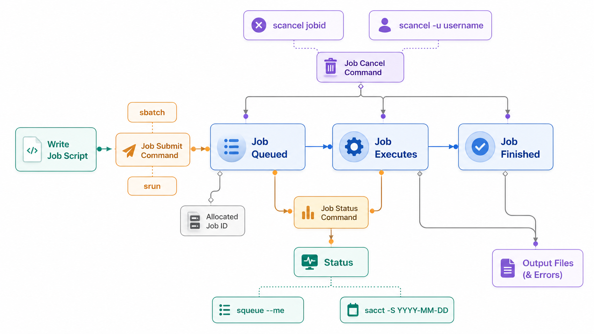

# Working with job scheduler

<p align="center" style="margin-bottom: -1px;">
    
</p>


## Introduction to slurm scheduler and directives

An HPC system might have thousands of nodes and thousands of users. How do we decide who gets what and when? How do we ensure that a task is run with the resources it needs? This job is handled by a special piece of software called the scheduler. On an HPC system, the scheduler manages which jobs run where and when. In brief, scheduler is a 

!!! quote ""

    * Mechanism to control access by many users to shared computing resources
    * Queuing / scheduling system for users’ jobs
    * Manages the reservation of resources and job execution on these resources 
    * Allows users to “fire and forget” large, long calculations or many jobs (“production runs”)

!!! circle-info "A bit more on why do we need a scheduler ?"

    * To ensure the machine is utilised as fully as possible
    * To ensure all users get a fair chance to use compute resources (demand usually exceeds supply)
    * To track usage - for accounting and budget control
    * To mediate access to other resources e.g. software licences

    **Commonly used schedulers**
    
    * [x] Slurm
    * PBS , Torque
    * Grid Engine
    
    All NeSI clusters use Slurm (Simple Linux Utility for Resource Management) scheduler (or job submission system) to manage resources and how they are made available to users.

   

    <p align="center" style="margin-bottom: -1px;">
        
    </p>

    <small>Researchers can not communicate directly to  Compute nodes from the login node. Only way to establish a connection OR send scripts to compute nodes is to use scheduler as the carrier/manager</small>

## Anatomy of a slurm script and submitting first slurm job 🧐

As with most other scheduler systems, job submission scripts in Slurm consist of a header section with the shell specification and options to the submission command (`sbatch` in this case) followed by the body of the script that actually runs the commands you want. In the header section, options to `sbatch` should be prepended with `#SBATCH`.


<p align="center" style="margin-bottom: -1px;">
    
</p>


!!! square-pen "Commented lines `#`"

    Commented lines are ignored by the bash interpreter, but they are not ignored by slurm. The `#SBATCH` parameters are read by slurm when we submit the job. When the job starts, the bash interpreter will ignore all lines starting with `#`. This is very similar to the shebang mentioned earlier, when you run your script, the system looks at the `#!`, then uses the program at the subsequent path to interpret the script, in our case `/bin/bash` (the program `bash` found in the */bin* directory

!!! bell gradient-peek "Assigning values to Slurm variables (formatting correctly examples)"

    <p align="center" style="margin-bottom: -1px;">
        
    </p>


## Try it yourself

Adjust the fields below and hit **Generate script** to see a real submission script.

<slurm-generator></slurm-generator>

<br/>

## Life cycle of a slurm job


<p align="center" style="margin-bottom: -1px;">
    
</p>


## Example scripts

<div class="nord" markdown=1>
!!! file-code "Example scripts"

    - We have prepared few examples to practise writing and review template scripts. 
    ```py
    wget -c https://github.com/kir-rescomp/kir-researchcomp-hub/releases/download/v1.0/slurm_examples.zip && slurm_examples.zip
    ```

    - Content of the directory
    ```py
    slurm_examples
    ├── python_slurm
    │   └── pi.py
    └── r_slurm
        ├── power_analysis_demo.R
        ├── README.md
        └── submit.sl
    ```

