# Data Transfer with CLI Tools

Transfer files between your local machine and the BMRC cluster using `scp` or `rsync` over SSH.

!!! lightbulb "Set up your SSH config first"
    Follow the [recommended terminal setup guide](https://kir-rescomp.github.io/kir-researchcomp-hub/getting-started/connect_ssh_config/) before using the commands on this page. This configures short hostnames (`bmrc4`, `bmrc5`, etc.) so you can use them directly in `scp` and `rsync` — no need to type `username@cluster4.hpc.in.bmrc.ox.ac.uk` every time.

---

## How it works

All file transfers run over SSH, following the same **local → remote** or **remote → local** direction. The source always comes first, the destination second.

<p align="center" style="margin-bottom: -1px;">
    
</p>

## `scp` — secure copy

`scp` is the simplest option for one-off file transfers.

### Upload (local → remote)

<div class="nord" markdown=1>
```py
# Single file
scp ./myfile.txt bmrc4:~/data/

# Directory (use -r for recursive)
scp -r ./results/ bmrc4:~/results/
```

### Download (remote → local)

```py
# Single file — copy to current directory
scp bmrc4:~/results/output.csv ./

# Directory
scp -r bmrc4:~/results/ ./local_results/
```

!!! note-sticky "Note"
    `scp` does not resume interrupted transfers. For large files, prefer `rsync` (see below).

---

## `rsync` — efficient sync

`rsync` is preferred for directories, large files, or anything you might transfer repeatedly. It only copies files that have changed, and can resume a partial transfer.

### Upload (local → remote)

```py
# Sync a directory
rsync -av ./results/ bmrc4:~/results/

# With progress bar and partial resume
rsync -av --progress --partial ./large_dataset/ bmrc4:~/data/large_dataset/
```

### Download (remote → local)

```py
# Sync results back to your machine
rsync -av bmrc4:~/results/ ./local_results/
```

### Dry run first

Use `-n` (`--dry-run`) to preview what will be transferred before committing:

```py
rsync -avn ./results/ bmrc4:~/results/
```

!!! warning "Trailing slash matters in `rsync`"
    `rsync -av ./results/ bmrc4:~/dest/` copies the **contents** of `results/` into `dest/`.  
    `rsync -av ./results bmrc4:~/dest/` copies the **directory itself**, creating `dest/results/`.  
    When in doubt, use a dry run first.

## Common flags

| Flag               | `scp` | `rsync` | Effect                                           |
| ------------------ | :---: | :-----: | ------------------------------------------------ |
| `-r`               |   ✓   |    —    | Recursive (directories)                          |
| `-v`               |   ✓   |    ✓    | Verbose output                                   |
| `-a`               |   —   |    ✓    | Archive mode (preserves permissions, timestamps) |
| `--progress`       |   —   |    ✓    | Show per-file progress                           |
| `--partial`        |   —   |    ✓    | Keep partial files for resume                    |
| `-n` / `--dry-run` |   —   |    ✓    | Preview changes without transferring             |
| `-z`               |   ✓   |    ✓    |                                                  |


## Quick reference

```py
# scp upload
scp [options] <local_source>  <host>:<remote_dest>

# scp download
scp [options] <host>:<remote_source>  <local_dest>

# rsync upload
rsync -av [options] <local_source>/  <host>:<remote_dest>/

# rsync download
rsync -av [options] <host>:<remote_source>/  <local_dest>/
```

Replace `<host>` with `bmrc4`, `bmrc5`, etc. (requires [SSH config setup](https://kir-rescomp.github.io/kir-researchcomp-hub/getting-started/connect_ssh_config/)).