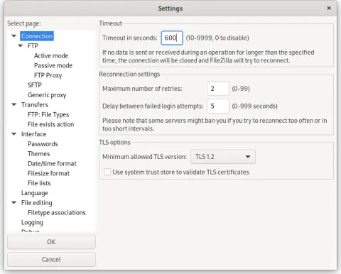
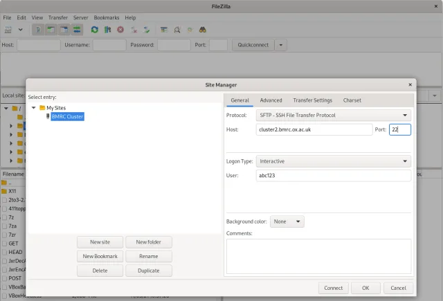
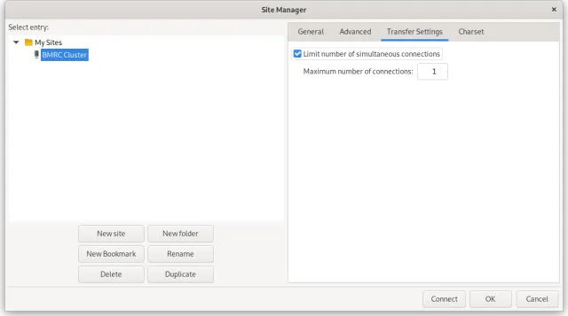
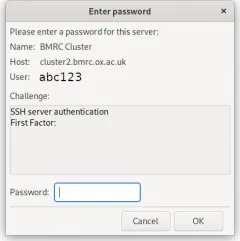

# Data Tranfer with FileZilla

FileZilla is a popular tool for SFTP file transfers and can be used to transfer files to/from BMRC with additional configuration as follows.

!!! desktop-download-24 "FileZilla can be downloaded from https://filezilla-project.org/download.php?show_all=1"

## Configuring FileZilla for Two Factor Authentication

1. Open FileZilla from the Menu Bar select <kbd>Edit</kbd> -> <kbd>Settings</kbd>. 
    - In the Connection settings tab, set your timeout value to **600** seconds (ten minutes).
    - Then click <kbd>OK</kbd> to save your settings.
    

        
    

2. From FileZilla's main window, click the <kbd>Site Manager</kbd> button (underneath the File menu) to display the Site Manager window.
    

        
    

3. Click `New Site` to configure your connection to the BMRC cluster and copy the details shown above, namely:

    !!! quote ""
        - **Protocol**: SFTP
        - **Host**: cluster2.bmrc.ox.ac.uk
        - **Port**: 22
        - **Logon Type**: Interactive
        - **User**: [Enter your username]

        NOTE: If connecting to another BMRC server, adjust the Site Name and Host settings as needed.

4. Now select the Transfer Settings tab, enable Limit number of simultaneous connections and set to `1`
    

        
    

5. Now click OK to save this configuration. Back at the main window, click the down-arrow next to the Site Manager button and select BMRC Cluster. 
   This will begin the login process.
6. If FileZilla warns you about an Unknown host key, tick the box marked Always trust this host, add this key to the cache and click OK.
7. FileZilla will now prompt you to enter your First Factor i.e. your password:

    

        
    

8. After entering your password and clicking OK, FileZilla will then prompt you to enter your second factor code:

9. After entering your second factor code and clicking OK, FileZilla should now be connected. The left hand size of the FileZilla window will be showing files on your local computer. The right hand side will be showing files on the BMRC Cluster (or whatever remote site you have configured). Remember that on the BMRC cluster, all data should be stored in your group area under `/well/<group>/users/<username>/` - so you may need to navigate to the appropriate location in the right hand window before dragging and dropping files between the two systems.
