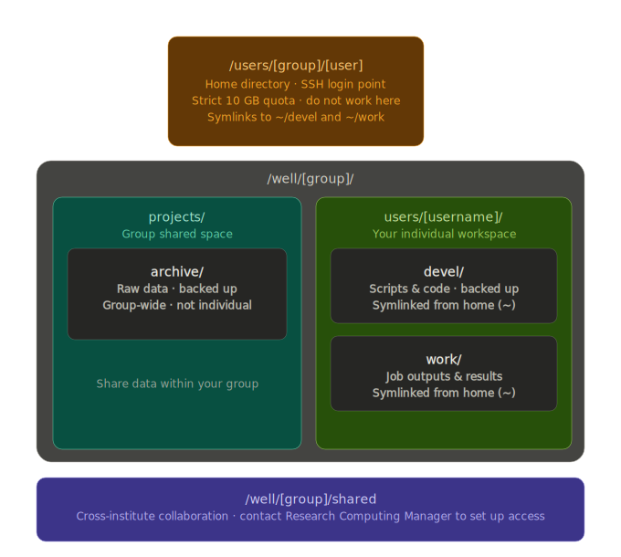

# Filesystem layout

When you log in to the cluster you land in your **home directory**. Unlike most Linux systems, the path is slightly non-standard:

<div class="nord" markdown=1>
```py
/users/<group>/<username>
```

where `<group>` is your research group name.

!!! warning "Home directory — 10 GB strict quota"
    Do **not** use your home directory for active work. The 10 GB limit fills quickly once you start running jobs, installing software, or writing output. Use the paths below instead.

## Quick-reference diagram

<p align="center" style="margin-bottom: -1px;">
    
</p>

## Where to store raw data

Use `/well/<group>/projects/archive` for raw, unprocessed data files. This directory is **backed up** by KIR Research Computing.

!!! circle-info-2 "This is a Shared space — not personal"
    `archive/` is a group-wide directory. Everyone in `<group>` can read and write here. It is **not** an individual allocation, so coordinate with your colleagues before writing large datasets.

## Where to do your work

Your personal working space lives at:

```py
/well/<group>/users/<username>/
```

This is where you should run jobs, install software, and store intermediate files. Two subdirectories are pre-created and symlinked into your home directory for convenience:

| Path | Purpose | Backed up? |
|---|---|---|
| `devel/` | Scripts, code, notebooks | Yes |
| `work/` | Job outputs, results, scratch | No |

The symlinks mean you can reach them as `~/devel` and `~/work` immediately after login.

!!! tip
    `work/` exists to encourage a project-based layout, but you are free to create your own subdirectory structure inside it as needed.

## Sharing within your group

`/well/<group>/projects/` is the space for sharing data and output files with colleagues in your group. Store anything you want others to access here.

## Collaborating with groups outside KIR

`/well/sansom/shared` is available for cross-institute collaboration, but access requires special group membership to be configured.

**Contact KIR  Research Computing Manager** to create shared groups. 