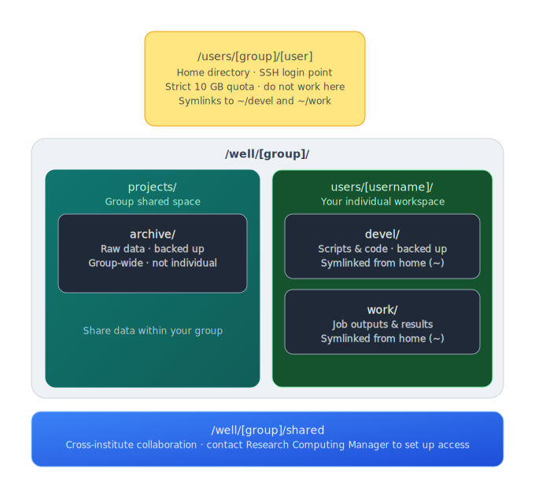

# Filesystem layout

When you log in to the cluster you land in your **home directory**. Unlike most Linux systems, the path is slightly non-standard:

<div class="nord" markdown=1>
```py
/users/<group>/<username>
```

where `<group>` is your research group name.

!!! warning "Home directory — 10 GB strict quota"
    Do **not** use your home directory for active work. The 10 GB limit fills quickly once you start running jobs, installing software, or writing output. Use the paths below instead.

## Quick-reference diagram

<p align="center" style="margin-bottom: -1px;">
    
</p>

## Where to store raw data

Use `/well/<group>/projects/archive` for raw, unprocessed data files. This directory is **backed up** by KIR Research Computing.

!!! circle-info-2 "This is a Shared space for your group"
    `archive/` is a group-wide directory. Everyone in `<group>` can read and write here. It is **not** an individual allocation, so coordinate with your colleagues before writing large datasets.

## Where to do your work

Your personal working space lives at:

```py
/well/<group>/users/<username>/
```

This is where you should run jobs, install software, and store intermediate files. Two subdirectories are pre-created and symlinked into your home directory for convenience:

<div class="center-table" markdown="1">

| Path | Purpose | Backed up? |
|---|---|---|
| `devel/` | Scripts, code, notebooks | Yes |
| `work/` | Job outputs, results, scratch | No |

</div>

The symlinks mean you can reach them as `~/devel` and `~/work` immediately after login.

## Minimising disk usage

Storage on BMRC is a shared resource. A few habits go a long way:

- **Never copy raw data if you can avoid it.** If your input files already live in `archive/` or a colleague's project directory, create a symlink rather than duplicating them:
    ```py
    ln -s /well/<group>/projects/archive/my_dataset ~/work/my_project/data
    ```
- **Write outputs to `work/`, not `devel/`.** `devel/` is backed up — filling it with large result files wastes backup quota and slows snapshots.

- **Clean up intermediate files** once a pipeline has finished successfully. Temporary BAM files, uncompressed intermediates, and failed run directories accumulate quickly.

- **Compress where ^^practical^^.** Tools like `gzip`, `bgzip`, and `zstd` can reduce storage footprint significantly, especially for text-based formats (FASTQ, VCF, BED).

- **Check your usage regularly** ( refer to [ Storage Quota](./storage_quota.md) ) 

!!! lightbulb "When in doubt, symlink"
    Symlinks are free. Copies cost quota. If multiple projects need the same reference genome or input dataset, one copy in `archive/` with symlinks pointing to it from each `work/` subdirectory is always preferable.

    - Also, `work/` exists to encourage a project-based layout, but you are free to create your own subdirectory structure inside it as needed.


## Sharing within your group

`/well/<group>/projects/` is the space for sharing data and output files with colleagues in your group. Store anything you want others to access here.

## Collaborating with groups outside KIR

`/well/<group>/shared` is available for cross-institute collaboration, but access requires special group membership to be configured.

**Contact KIR  Research Computing Manager** to create shared groups. 