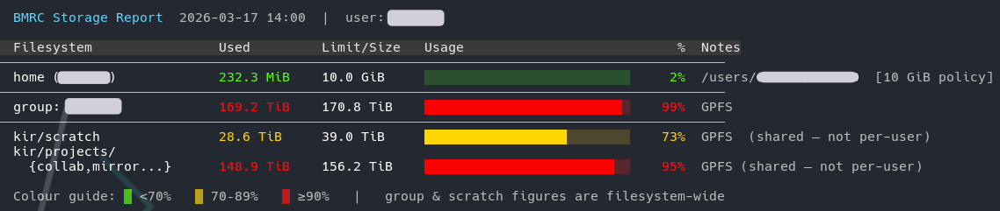

# Storage Quota


## Checking your storage quota

Run `storage_quota` to see your current usage and limits across all allocations.

<p align="center" style="margin-bottom: -1px;">
    
</p>

<div class="nord" markdown=1>
!!! circle-info-2 ""
    `storage_quota` is part of the `KIR-utils` module. If you see `command not found`, load it first:
    ```py
    module load KIR-utils
    ```


As a fallback, you can also check your group allocation directly:

```py
df -BG /well/<group>
```

### If your home directory is nearly full

Your home directory has a small quota and is not intended for large data. If it is filling up, take action promptly — a full home directory can prevent jobs from running and cause login issues.

To identify what is taking up space, including hidden directories:

```py
du -h -d 1 ~ | sort -hr
```

This lists the top-level contents of your home directory in descending order of size.

