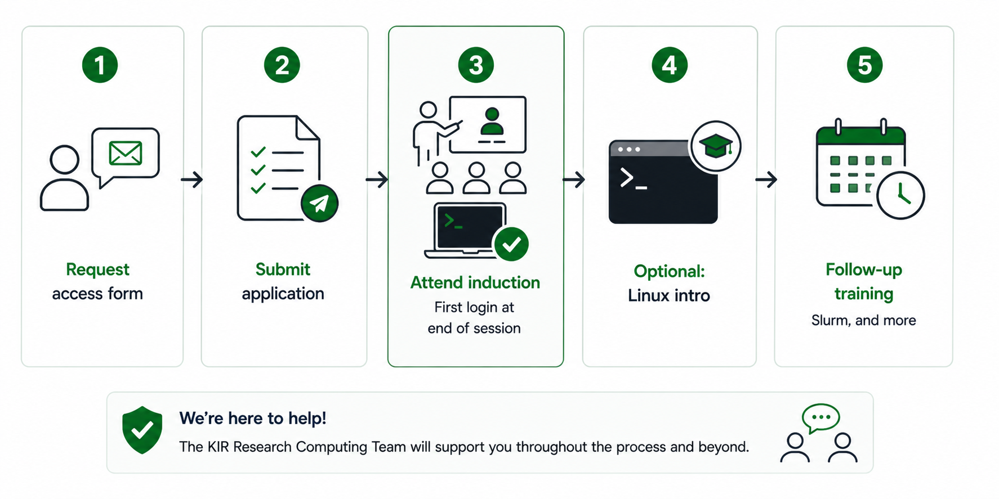

    

- - - 
 

!!! circle-info-2 ""
    Links with :material-lock: requires a connection to the MSD VPN

### Rules and regulations

Access to the HPC systems and services are provided for authorised work purposes only. 

In using them you are bound by the terms and conditions of the [University of Oxford's IT Regulations](https://governance.admin.ox.ac.uk/legislation/it-regulations-1-of-2002), the [NDORMS Information Security Policy](https://www.ndorms.ox.ac.uk/information-security-policy) and you must follow the [KIR Information Governance Policy](https://rcwiki.kennedy.ox.ac.uk/information_governance) :material-lock:.

 Where necessary, and within the relevant laws and regulations, the Kennedy Institute and the University of Oxford reserve the right to exercise control over all activities employing its computer facilities, including examining the content of users' data.

## Applying for an account

Kennedy Institute of Rheumatology researchers can access the [Medical Sciences Division Biomedical Research Computing cluster](https://www.medsci.ox.ac.uk/for-staff/resources/bmrc) via a dedicated workspace. If you intend to use High Performance Computing in your research, please discuss this with your PI first and then complete the [User Registration Form](https://rcwiki.kennedy.ox.ac.uk/kir_bmrc_user_registration_form_v4.docx):material-lock:. Please send the completed form to dini.senanayake@kennedy.ox.ac.uk.

A description of the facility and  details of the current access charges can be found here:  [The KIR BMRC shared research facility for high performance computing](https://rcwiki.kennedy.ox.ac.uk/the_kir_bmrc_srf_for_high_performance_computing.pdf):material-lock:. 

- - -

## BMRC cluster user induction
 
Once your registration form has been processed, an account will be created and you will receive a welcome message notifying you about your user name on the cluster. An induction session with the BMRC cluster team will be arranged to set up two-factor authentification.

!!! note-sticky "Linux command line experience"

    If you do not have experience with using the Linux command line, it is recommended that you complete an online training course, such as this one:https://kir-rescomp.github.io/training-intro-to-linux-cli/, ( Or contact KIR Research Computing Manager to arrange a session).

