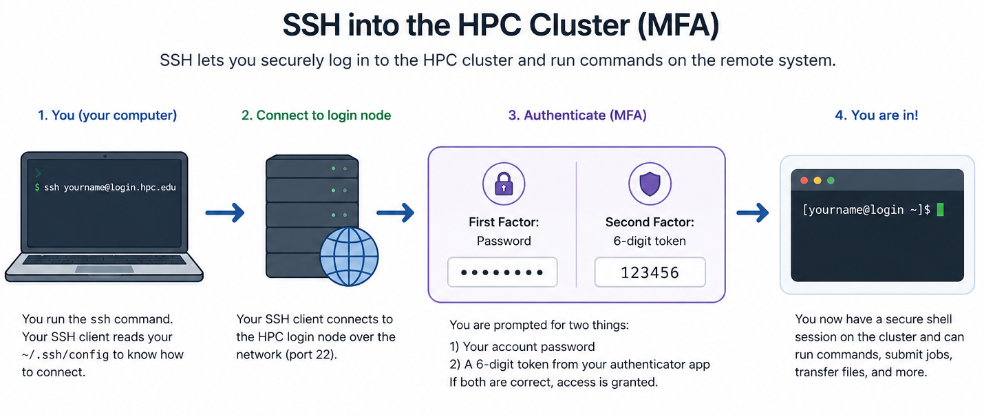

# Connecting to the cluster

<p align="center" style="margin-bottom: -1px;">
    
</p>

## Local Access

To connect to the BMRC cluster, while connected to a local wired network at the Kennedy Institute or `eduroam`, run the following command replacing `username` with your username for the cluster in your local computer terminal. You can connect to either `cluster1`, `cluster2` , `cluster3` or `cluster4` by changing the command accordingly: 

<div class="nord" markdown="1">
```py
ssh bmrcusername@cluster1.bmrc.ox.ac.uk
```

## First Time Login  - Setting a New Cluster Password

On your first login to the BMRC cluster, you will be required to replace your temporary password with a new cluster password.

!!! info "Before you begin"
    This guide assumes that:

    - You have received a **temporary password** by email from the KIR Research Computing Manage OR BMRC Team
    - You have set up **two-factor authentication (2FA)** by scanning the QR code provided by the KIR Research Computing Manager. Any authenticator app may be used (e.g. Microsoft Authenticator, Authy, Google Authenticator).

### Connecting to the cluster

Open a terminal and run the following command, replacing `bmrcusername` with your BMRC username:

```py
ssh bmrcusername@cluster1.bmrc.ox.ac.uk
```

!!! tip
    No characters are displayed while you type a password. This is expected behaviour.

The password reset then follows a three-step process.

=== "Step 1"

     <h4>Authenticate with your temporary password</h4>


    You will be prompted for two factors:

    | Prompt | What to enter |
    |---|---|
    | `First Factor` | The temporary password sent to you by email. Copying and pasting it is recommended. |
    | `Second Factor` | The current six-digit token from your 2FA app, without spaces. |

=== "Step 2"

    <h4>Confirm your current password</h4>

    You will see a message stating that your password has expired, followed by these prompts:

    !!! warning "Wait for a new token"
        Before completing the `Second Factor` prompt in Step 2, wait until your 2FA app displays a **new** six-digit token. Re-entering the token used in Step 1 will cause the password reset to fail.

    | Prompt | What to enter |
    |---|---|
    | `Current Password` | The same temporary password used in Step 1. |
    | `Second Factor` | A **new** six-digit token from your 2FA app. |


=== "Step 3"

    <h4>Set your new password</h4>

    You will be prompted to enter your `New Password` and then to confirm it.

    The new password must meet the same requirements as your University SSO password:

    - At least 16 characters
    - At least one upper-case letter
    - At least one lower-case letter
    - At least one digit
    - At least one special character


### If the password reset fails

If the reset is unsuccessful, the process returns to **Step 1**, and you will need to repeat Steps 1 to 3.

The two most common causes of a failed reset are:

1. Entering the **same six-digit token** at the `Second Factor` prompt in both Step 1 and Step 2.
2. A **mismatch** between the new password and its confirmation entry.

### Successful login

Once your password has been changed successfully, you will be logged into the `cluster1` login node, and your terminal prompt will change to show your username and the node name, for example:

```py
[bmrcusername@cluster1 ~]$
```

Use your new cluster password, together with a 2FA token, for all future logins.


## Remote Access

For remote connections (when away from the University), you will need to connect to Oxford VPN (**vpn.ox.ac.uk**) OR one of the MSD vpns

