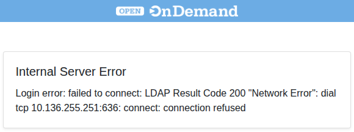

# Login Troubleshooting

## `ssh` login : Asked for `Password` instead of `First Factor`

- Login to BMRC via a terminal client follows a two prompt sequence, `First Factor:` ( prompt to enter your BMRC password) `Second Factor` ( Six digit 2FA token generated by an App such MS Authenticator for your BMRC account)

- If you receive the prompt `Password`, kill the login attempt immediately with <kbd>Ctrol</kbd>+<kbd>C</kbd>. This means either:

    1. Your account is locked out due to too many authentication failures. Wait about 10 minutes before trying again (make sure to use your BMRC password and second-factor token).
    2. The cluster login nodes are not operating correctly (maintenance or unexpected failure). Ideally, reach out to the KIR Research Computing manager directly or via kir-rc@kennedy.ox.ac.uk

## OnDemand login failed due to `Internal Server Error`

If you see the following error while attempting to access [OnDemand as per](../interactive-computing/openondemand.md), it is an indication of a system-wide issue. Contact KIR Research Computing Manager

 

    

