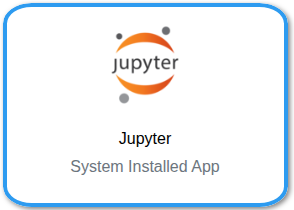
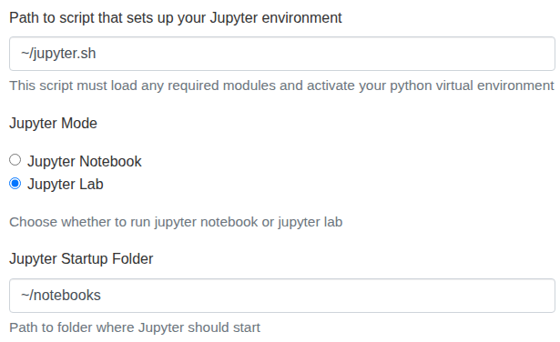
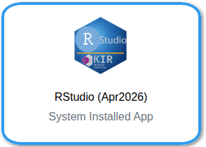
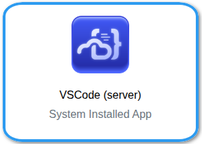
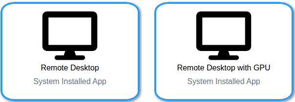

# Interactive Computing with OnDemand


!!! exclamation "Make sure you are connected to VPN"

    Similar to [ssh access](../getting-started/connect_ssh_config.md), OnDemand requires your device to be on Oxford VPN, MSD VPN, or eduroam (no VPN needed if already on eduroam WiFi)

    To log in to OnDemand, enter your BMRC user name and then your ==BMRC password immediately followed by 6-digit second authentication factor in the same password field==.

    <div style="
      background: var(--md-primary-fg-color--light, #f0f4ff);
      border-left: 4px solid var(--md-primary-fg-color);
      border-radius: 6px;
      padding: 1rem 1.25rem;
      margin-bottom: 1.5rem;
      display: flex;
      align-items: center;
      justify-content: space-between;
      flex-wrap: wrap;
      gap: 0.75rem;
    ">
      <div>
        <strong>BMRC Open OnDemand</strong><br>
        <code>ondemand00.bmrc.ox.ac.uk:12000</code>
      </div>
      <a href="https://ondemand00.bmrc.ox.ac.uk:12000/" target="_blank" class="md-button md-button--primary">
        Launch 
      </a>
    </div>

## OnDemand Apps

=== "JupyterLab"
    <p align="center" style="margin-bottom: -1px;">
        
    </p>

    !!! clipboard-list "Prerequisites"
        Before launching the Jupyter app, ensure you have:
        1. A Python virtual environment set up — see [Creating a Python virtual environment](https://kir-rescomp.github.io/kir-researchcomp-hub/software/application_specific_notes/Python/#python-virtual-environments)
        2. At least one Jupyter kernel registered, either:
          - Using `kir-add-kernel` (available with the `JupyterLab/4.5.6`> module) — see [Registering a kernel with kir-add-kernel](https://kir-rescomp.github.io/kir-researchcomp-hub/interactive-computing/add_jupyter_kernels/#option-1-tool-assisted-management-with-kir-add-kernel)
          - Or manually — see [Manually registering a Jupyter kernel](https://kir-rescomp.github.io/kir-researchcomp-hub/interactive-computing/add_jupyter_kernels/#option-2-manual-kernel-registration-with-ipykernel)

    ### Step 1 — Create your `jupyter.sh` setup script

    The app requires a shell script that prepares your Jupyter environment before the session starts.
    This script must load any required modules and/or activate your Python virtual environment
    Create a file called `jupyter.sh` in your home (easier to call it from home) directory:
    
    <div class="nord" markdown=1>
    ```py
    touch ~/jupyter.sh
    ```
    </div>

    Then edit it to match your setup. Choose one of the following approaches:
    !!! quote ""

        === "1.Load the JupyterLab module"

            Use this if you are relying on kernels registered via `kir-add-kernel` and do not need to
            activate a specific virtual environment for the Jupyter process itself:
            <div class="nord" markdown=1>
            ```py
            #!/bin/bash
            module purge
            module load JupyterLab/4.5.6
            ```
            </div>

        === "2.Activate a virtual environment"

            Use this if you have installed JupyterLab directly into a virtual environment:
            <div class="nord" markdown=1>
            ```py
            #!/bin/bash
            module purge
            module load Python/....
            source ~/venvs/my-env/bin/activate
            ```
            </div>

    ### Step 2 — Fill in the launch form
    <p align="center" style="margin-bottom: -1px;">
        
    </p>
    #### Path to script that sets up your Jupyter environment
    
    Enter the path to the `jupyter.sh` script you created above:
    <div class="nord" markdown=1>
    ```py
    ~/jupyter.sh
    ```
    </div>
    
    #### Jupyter Mode
    
    Select either **Jupyter Notebook** or **JupyterLab** depending on your preference. JupyterLab is
    recommended for most users as it provides a more fully featured interface.
    
    #### Jupyter Startup Folder

    This is the directory that Jupyter will open in, and it also acts as the **root of the file
    browser** within your session. You will not be able to navigate above this folder from within
    Jupyter. For an example, 

    <div class="nord" markdown=1>
    ```py
    ~/notebooks
    ```
    </div>
    !!! lightbulb  "Choose your startup folder carefully"
        Set this to the top-level directory that contains your project files. For example, if your work
        lives under `/well/<group>/users/$USER/`, setting the startup folder to that path means you can
        browse your full project structure from within Jupyter without having to navigate around it.


=== "RStudio"
    !!! clipboard-list "Prerequisites"

        Prior to launching `RStudio-server` via **OnDemand**, make sure to setup your `~/.Rprofile` according to [these
        instructions](https://kir-rescomp.github.io/kir-researchcomp-hub/software/application_specific_notes/R/#setting-up-rprofile-dynamic-r-library-paths-version-aware-rprofile-configuration)
        
    !!! note-sticky "There are three RStudio apps in the OnDemand dashboard. Please choose the one with the custom logo below; the other two are legacy and support only up to R/4.3*" 
    <p align="center" style="margin-bottom: -1px;">
        
    </p>

=== "VScode (server)"
    <p align="center" style="margin-bottom: -1px;">
        
    </p>

    The Code Server app launches a [VS Code](https://code.visualstudio.com/) environment running
    directly on a BMRC compute node, accessible from your browser — no local VS Code installation
    required.

    ### How this differs from the VS Code Remote extension

    If you have used the
    [VS Code Remote - SSH extension](https://marketplace.visualstudio.com/items?itemName=ms-vscode-remote.remote-ssh)
    from your local machine, the experience will feel familiar, but there is an important distinction:

    - **Remote - SSH** runs VS Code locally and tunnels into the cluster over SSH. Your local machine
      handles the interface; the cluster handles computation.
    - **Code Server** runs VS Code entirely on the cluster, served through your browser. There is no
      dependency on your local VS Code installation or SSH tunnel — the session is managed by
      OpenOnDemand like any other job.

    ### Installing extensions

    Because the Code Server session runs on a compute node with no internet access, you cannot install
    extensions directly from the marketplace in the usual way.

    You can still install extensions manually by downloading the `.vsix` file from outside the cluster
    and installing it via the command line:

    1. Download the `.vsix` file for your extension from the
       [VS Code Marketplace](https://marketplace.visualstudio.com/) on your local machine
    2. Transfer it to BMRC (e.g. via `scp` or the OOD file browser)
    3. Install it with:

    <div class="nord" markdown=1>
    ```py
    code-server --install-extension /path/to/extension.vsix
    ```
    </div>

    The extension will then be available the next time you launch a Code Server session.


=== "Virtual Desktop" 
    <p align="center" style="margin-bottom: -1px;">
        
    </p>

    The Virtual Desktop app launches a full graphical desktop environment on a BMRC compute node,
    accessible directly from your browser. No SSH tunnelling or local X11 setup required.

    This is useful when you need to:

    - Run applications with a graphical user interface (GUI), such as IGV, QuPath, or  data interactively using tools that don't work well in a notebook environment
    - Use desktop-based workflow tools or file managers on the cluster

    The launch form lets you select your partition, number of CPUs, memory, and walltime — fill these
    in as you would for any other Slurm job.

    !!! lightbulb "Tip"
        If you only need a terminal on a compute node, use the [Jupyter](#) or [srun](#) options
        instead — Virtual Desktop has a higher resource overhead and should be reserved for work that
        genuinely requires a GUI.


## Troubleshooting 


!!! stethoscope "RStudio stuck on grey screen after connecting"

    If you click **Connect** on an RStudio OnDemand session but are greeted with a
    persistent grey screen, the previous session likely saved a large object to its
    workspace and RStudio is attempting to restore it on launch — which can stall or
    hang indefinitely.
    
    **Fix:** Delete the active session state to clear the saved workspace:
    
    !!! exclamation "warning"
        This will discard any unsaved objects from your previous R session.
        Scripts and files on disk are unaffected.
    
    <div class="nord" markdown=1>
    ```py
    rm -rf ~/.local/share/rstudio/sessions/active/
    ```
    </div>
    Once done, relaunch your RStudio session from OnDemand as normal.
    
