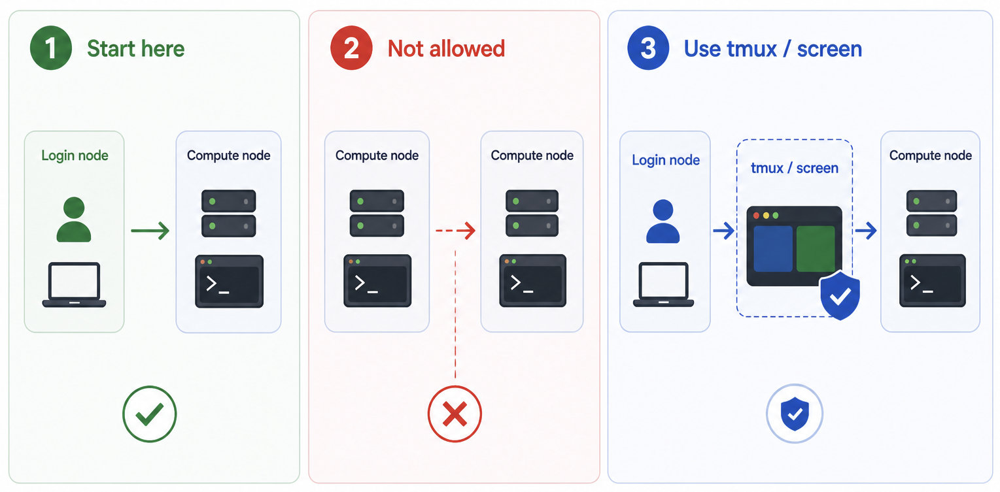

# Terminal based interactive sessions with `srun`

<p align="center" style="margin-bottom: -1px;">
    
</p>


## What is `srun` and when should you use it?

`srun` is the Slurm command for launching **interactive jobs** — sessions where you work directly in a terminal on a compute node in real time, rather than submitting a script to run in the background.

!!! square-pen "Use `srun` when you need to:"

    - Explore data or test commands interactively before writing a batch script
    - Run short, exploratory analyses that don't warrant a full `sbatch` submission
    - Debug a pipeline step directly on a compute node
    - Use software that requires an interactive terminal — e.g. workflow managers such as Snakemake or 
      Nextflow, where launching the pipeline interactively can be more convenient than wrapping a command 
      with `sbatch --wrap`

!!! circle-info-2 "srun sessions are still Slurm jobs"
    Even though `srun` feels like a regular terminal session, it is a full Slurm job under the hood. It consumes resources from your allocation, appears in `squeue`, and is subject to the same partition limits and scheduling policies as any `sbatch` job.

---

## Where to run `srun`

You must invoke `srun` from a **login node**. Running `srun` from within an existing compute node session (e.g. from inside another job) is not permitted on BMRC.

---

## Run your `srun` session inside tmux

We strongly recommend launching `srun` from within a **tmux session** rather than directly in your login shell.

If your SSH connection drops while `srun` is running in the foreground, the session will be terminated — and any work in progress will be lost. A tmux session persists on the login node independently of your SSH connection, so you can safely reconnect and resume.

<div class="nord" markdown=1>
```py
# Start or attach a tmux session on the login node
tmux new -s interactive

# Then launch your interactive job from within tmux
srun --partition=short --cpus-per-task=4 --mem=16G --time=02:00:00 --pty bash
```
</div>

For a full guide on using tmux on BMRC, see the [tmux support page](./tmux.md).

---

## Request resources carefully — especially time

When you submit an `srun` job, you must specify how long you need the session (`--time`). Slurm will hold the compute node for the full duration you request, **even if you finish early**.

!!! warning "Release resources when you're done"
    If you requested a 30-hour session but finish your work in 3 hours, the node remains allocated to you for the remaining 27 hours — blocking other users from accessing those resources.

    Always release your session as soon as you are finished, either by:

    - Typing `exit` in the interactive shell to end the session cleanly
    - Or, if the session is detached or unresponsive, cancelling it by job ID:
    <div class="nord" markdown=1>
    ```py
    # Find your srun job ID
    squeue --me

    # Cancel it
    scancel <jobid>
    ```
    </div>

As a rule of thumb: **request the time you expect to need, plus a small buffer** — and don't leave sessions running overnight unless you genuinely intend to use them.
