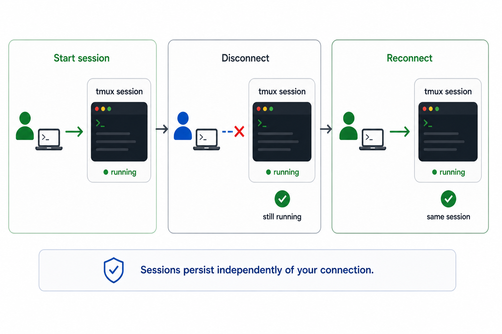
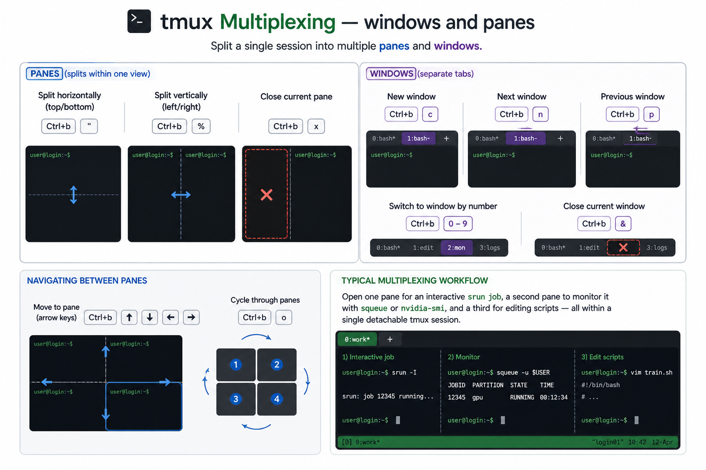

# `tmux` to support long running terminal sessions

When you connect to the cluster via SSH, your session is tied to that connection — if it drops, any running processes are lost. `tmux` (terminal multiplexer) solves this by running a persistent session on the login node that survives disconnections. It also lets you split your terminal into multiple panes and windows within a single SSH connection.

!!! circle-info-2 "Note"
    The figure above gives an overview of how `tmux` sits between your SSH client and your shell processes on the login node.

<p align="center" style="margin-bottom: -1px;">
    
</p>

---

### Managing sessions

#### Open a new session

Always give your session a descriptive name so you can identify it later:

<div class="nord" markdown=1>
```py
tmux new -s mysession
```
</div>

#### Detach from a session

Detaching leaves the session (and anything running inside it) alive on the server. You can safely close your terminal after detaching.

| Action | Keybind |
|--------|---------|
| Detach from current session | ++ctrl+b++ then `d` |

#### List your sessions

<div class="nord" markdown=1>
```py
tmux ls
```


#### Attach to an existing session


```py
tmux attach -t mysession
```

If you only have one session running, `tmux attach` alone is sufficient.

#### Kill a session

When you are done and no longer need the session:

```py
tmux kill-session -t mysession
```
</div>
---

### Scrolling

By default, the scroll wheel does not work inside `tmux`. You need to enter **copy mode** first:

| Action | Keybind |
|--------|---------|
| Enter copy mode | ++ctrl+b++ then `[` |
| Scroll up | ++arrow-up++ / ++page-up++ |
| Scroll down | ++arrow-down++ / ++page-down++ |
| Exit copy mode | `q` |

---

### Multiplexing — windows and panes

`tmux` lets you split a single session into multiple **panes** (splits within one view) and **windows** (separate tabs).

#### Panes

| Action | Keybind |
|--------|---------|
| Split horizontally (top/bottom) | ++ctrl+b++ then `"` |
| Split vertically (left/right) | ++ctrl+b++ then `%` |
| Close current pane | ++ctrl+b++ then `x` |

#### Windows

| Action | Keybind |
|--------|---------|
| New window | ++ctrl+b++ then `c` |
| Next window | ++ctrl+b++ then `n` |
| Previous window | ++ctrl+b++ then `p` |
| Switch to window by number | ++ctrl+b++ then `0`–`9` |
| Close current window | ++ctrl+b++ then `&` |

#### Navigating between panes

| Action | Keybind |
|--------|---------|
| Move to pane (arrow keys) | ++ctrl+b++ then ++arrow-up++ / ++arrow-down++ / ++arrow-left++ / ++arrow-right++ |
| Cycle through panes | ++ctrl+b++ then `o` |

!!! lightbulb "Typical multiplexing workflow"
    A common pattern on the cluster is to open one pane for an interactive `srun` job, a second pane to monitor it with `squeue` or `nvidia-smi`, and a third for editing scripts — all within a single detachable `tmux` session.

<p align="center" style="margin-bottom: -1px;">
    
</p>


## Troubleshooting

1. "`sessions should be nested with care, unset $TMUX to force`"

    This warning appears when you run `tmux new -s <name>` from **inside an existing tmux session** 

    If you're unsure whether you're already inside tmux, check with following command  : ( Or check the for <span style="color: green;">green</span> strip on the bottom of the terminal), 

    <div class="nord" markdown=1>
    ```py
    echo $TMUX
    ```
    </div>

    A non-empty value means you're in an active session.