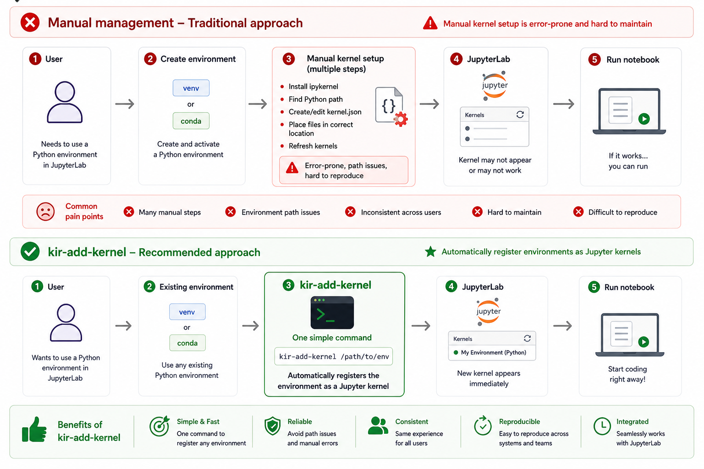

# Adding Jupyter Kernels
<div class="nord" markdown=1>
<p align="center" style="margin-bottom: -1px;">
    
</p>


There are two approaches to registering custom kernels with JupyterLab on the cluster:
**tool-assisted management** via `kir-jupyter-helpers`, or **manual registration** using
`ipykernel` directly. Both are supported — choose whichever fits your workflow.

---

### Option 1 — Tool-assisted management with `kir-add-kernel`

!!! lightbulb "Recommended for most users"
    `kir-add-kernel` keeps your environments untouched and supports shared group kernels —
    making it the preferred approach on BMRC.

The primary tool in [`kir-jupyter-helpers`](https://github.com/kir-rescomp/kir-jupyter-helper)
is `kir-add-kernel`. It solves a common frustration on HPC clusters: by default, Jupyter requires
`ipykernel` to be installed inside every environment you want to use as a kernel. This is
invasive — installing `ipykernel` into a carefully pinned conda environment or virtual environment
can silently upgrade or downgrade other packages, breaking reproducibility.

Instead, `kir-add-kernel` registers a lightweight **wrapper script** as the kernel. The wrapper
loads your environment — via the module system, conda, venv, or Apptainer — and delegates to
the `ipykernel` that ships with the cluster's JupyterLab module. Your environment stays untouched.

An added benefit is **shared kernels**: a single registration under your group's shared directory
makes the kernel available to all group members without each person needing to configure anything.

#### Usage

`kir-add-kernel` is bundled with the `JupyterLab` module — load it first:

```py
module load JupyterLab/4.5.6-GCCcore-12.3.0
```

Then register your environment as a kernel:

```py
kir-add-kernel <kernel-name> <module(s)> [--venv | --conda-name | --conda-path | --container]
```

#### Example — Python virtual environment

Suppose you have a virtual environment with the following:

| Property | Value |
|---|---|
| Environment name | `Singlecell_venv` |
| Path | `/users/group/myname/devel/Singlecell_venv` |
| Built with | `Python/3.11.3-GCCcore-12.3.0` |
| Desired kernel display name | `singlecell` |

Register it with:

```py
kir-add-kernel singlecell Python/3.11.3-GCCcore-12.3.0 \
    --venv /users/group/myname/devel/Singlecell_venv
```

Expected output:

```py
Testing wrapper script
Checking & installing ipykernel package in the kernel environment
Installing kernel: python -m ipykernel install --name singlecell --user
Installed kernelspec singlecell in /users/group/myname/.local/share/jupyter/kernels/singlecell
Added wrapper script in /users/group/myname/.local/share/jupyter/kernels/singlecell/wrapper.bash
Updated kernel JSON file /users/group/myname/.local/share/jupyter/kernels/singlecell/kernel.json

Use the following command to remove the kernel:

    jupyter-kernelspec remove singlecell
```

---

### Option 2 — Manual kernel registration with `ipykernel`

If you prefer direct control, you can register a virtual environment as a Jupyter kernel manually.
Note that this requires `ipykernel` to be installed into the environment itself.

=== "uv (recommended)"

    ```py
        uv venv myenv
        source myenv/bin/activate
        uv pip install ipykernel <your-other-packages>

        python -m ipykernel install --user --name myenv --display-name "My Env"
    ```

=== "pip"

    ```py
        python -m venv myenv
        source myenv/bin/activate
        pip install ipykernel <your-other-packages>
    
        python -m ipykernel install --user --name myenv --display-name "My Env"
    ```
    
    The `--user` flag installs the kernel spec to `~/.local/share/jupyter/kernels/`, which JupyterLab
    on BMRC picks up automatically. You can verify registered kernels and remove unwanted ones with:
    
    ```py
    jupyter kernelspec list
    jupyter kernelspec uninstall myenv
    ```