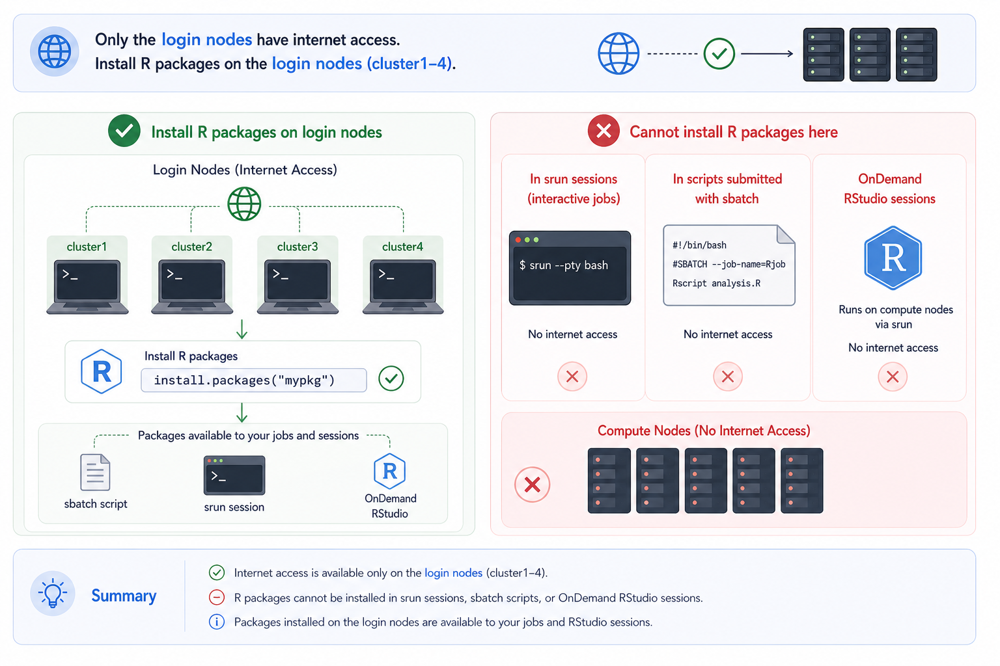

# R


R is available as a module and there are a number of different versions to choose from. If possible, try to use the latest version of R
at all times as some of the libraries in both CRAN and Bioconductor can drop support for older versions of R during release cycles.

<div class="nord" markdown=1>

- Search for available `R` modules with 


```py
module spider R
```

## Setting up `.Rprofile` - Dynamic R Library Paths - Version-Aware `.Rprofile` Configuration

By default, R will install packages to `~/R`, which sits in your home directory. Since home directory storage is limited on BMRC, 
we recommend redirecting your R library path to your group directory instead:

- Replace `{group}` and `{username}` with your group and username, respectively. 

```py
mkdir -p /well/{group}/users/{username}/devel/R
```

!!! lightbulb "symlink to `devel` from home"
    Most users already have a symlink at `~/devel` pointing to `/well/{group}/users/{username}/devel/`. If so, no extra steps are needed — the `.Rprofile` below will resolve the path automatically via the symlink.


Once the directory exists, create (or edit) `~/.Rprofile` and add the following:

```r
r_version <- paste(R.version$major,
                   strsplit(R.version$minor, "\\.")[[1]][1],
                   sep = ".")
platform <- R.version$platform
user_lib <- path.expand(sprintf("~/devel/R/%s-library/%s/", platform, r_version))

if (!dir.exists(user_lib)) {
  message(sprintf("Creating user library: %s", user_lib))
  dir.create(user_lib, recursive = TRUE, showWarnings = FALSE)
}
.libPaths(c(user_lib, .libPaths()))

options(repos = structure(c(CRAN = "https://cloud.r-project.org")))
options(bitmapType = 'cairo')
```

his snippet detects your current R version and CPU platform at startup, and constructs a versioned library path under `~/devel/R/`. For example, for R 4.4 on an x86-64 Linux system, packages will be installed to:

```py
~/devel/R/x86_64-pc-linux-gnu-library/4.4/
```

Keeping libraries version-stamped this way avoids binary incompatibility issues when you **switch** between R versions.

## R package installs

Compute nodes on BMRC do not have internet access, so package installations must be done on a **login node**. To install packages:

!!! quote ""
    1. SSH into the cluster (or Open **OnDemand** shell) 
    2. Load your desired R module:

        ```py
        module load R/4.4.0-foss-2023a
        ```
    3. Launch the R console:

        ```py
        R
        ```
    4. Install packages as normal, e.g.:
        ```r
        install.packages("ggplot2")
        ```

<p align="center" style="margin-bottom: -1px;">
    
</p>